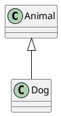
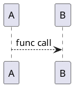

# テスト文章 for my plantuml-filter

## 作例1

```plantuml
@startuml doc-files/diagram1.svg
class Animal
class Dog
Animal <|-- Dog
@enduml
```

## 作例2

```plantuml
@startuml 
participant A
participant B
A --> B : func call
@enduml
```

終わり
